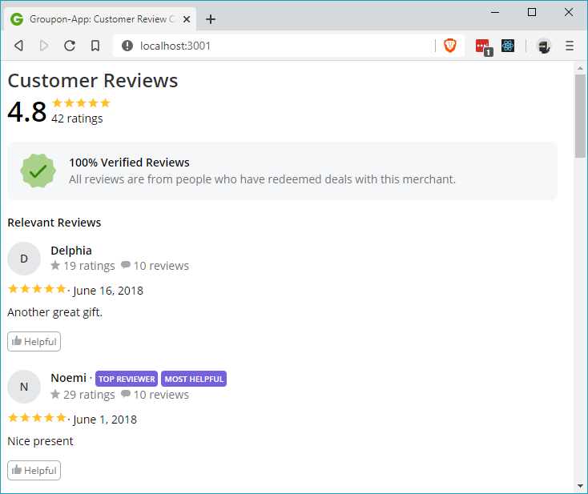

# Groupon-App - Customer Review Component (CRC)

This full-stack component will emulate the customer reviews from a product page on Groupon.com. This includes the reviews average, and each individual customer review (including the customer's name and extended profile - i.e. total number of reviews/ratings, helpfulness - review text for the product, and the review's helpfulness).

A back-end server is also included in this repo to correctly handle routes to `/api/:productId`, and to serve review data to the front-end React-based component.

## Related Projects

Other service components related to this can be found at https://github.com/coupon-app

These include:
  - https://github.com/coupon-app/service-image-carousel
  - https://github.com/coupon-app/service-deals

Proxy related to these services can be found here:
  - https://github.com/coupon-app/proxy-reviews

## Table of Contents

1. [Usage](#usage)
1. [Requirements](#requirements)
1. [Development](#development)

## Usage

1. (Ensure your MongoDB service is running) `$ npm run seed-reviews`
1. `$ npm run build-reviews`
1. `$ npm run start-reviews`

Navigate to `http://localhost:3001`

## Requirements
The following are required:
- Node (any recent version > 6). An `nvmrc` file is included if using [nvm](https://github.com/creationix/nvm).

## Development

### Installing Dependencies

From within the root directory:

`$ npm install`

### Testing
Tests and test coverage using Jest/Enzyme is included, and can be run via the command line:

`$ npm run test-reviews`
